# Kubernetes "Demo": Pod Autoscaling

## Goals

* Understand k8s Metrics API/Server
* Understand Horizontal Pod Autoscaler ("HPA")
* Run through a basic pod-autoscaling exercise
* Add an HPA to our `todoapi`

## Lab

### 1. Setup

Check out [the sept29demo](https://github.com/itt-learning-groups/todoapi/tree/sept29demo) branch of the `todoapi` repo in us-learn-and-devops GitHub.

    git fetch --all
    git checkout sept29demo

Note that I've added in installation of the Contour ingress controller, the jetstack cert-manager, and a TLS-cert ClusterIssuer in the `todoapi/build/cluster-deploy.sh` file.
You should probably replace my email address with your own in `letsencrypt.yaml`.

It can take a few seconds for the cert-manager's webhook to be available.
You might need to re-run the Lets Encrypt TLS-cert ClusterIssuer install if it tries to run before the webhook is ready.

### 2. Concepts

Note that there are a couple of different dimensions to autoscaling in k8s:

1. cluster (worker-node) scaling vs pod scaling
2. vertical vs horizontal scaling

Today, we'll be focusing on *pod* autoscaling, and specifically on *horizontal* autoscaling: i.e. scaling the number of pod replicas for a given deployment.
We'll cover cluster autoscaling separately. (It's coming up as our next topic.)

I won't cover vertical pod autoscaling, though k8s does offer a somewhat new vertical pod autoscaler. (See link below.)

Here are some very useful links to get a grasp on the basics:

* Horizontal Pod Autoscaler: <https://kubernetes.io/docs/tasks/run-application/horizontal-pod-autoscale/#default-behavior>
* Metrics APIs: <https://kubernetes.io/docs/tasks/run-application/horizontal-pod-autoscale/#support-for-metrics-apis>
* Metrics Server: <https://kubernetes.io/docs/tasks/debug-application-cluster/resource-metrics-pipeline/#metrics-server>
* How the k8s Metrics Server fits into the broader history & ecosystem of metrics collection / monitoring tools for k8s:
  * <https://www.datadoghq.com/blog/monitoring-kubernetes-performance-metrics/#where-kubernetes-metrics-come-from>
  * <https://github.com/kubernetes/metrics/blob/master/IMPLEMENTATIONS.md#custom-metrics-api>
  * <https://sysdig.com/blog/monitoring-kubernetes/>, see section *Kubernetes monitoring tools*, specifically
* K8s docs [Horizonal Pod Autoscaler Walkthrough](https://kubernetes.io/docs/tasks/run-application/horizontal-pod-autoscale-walkthrough/)
* Vertical Pod Autoscaler: <https://github.com/kubernetes/autoscaler/tree/master/vertical-pod-autoscaler>

### 3. Run through a basic pod-autoscaling exercise

We'll run through an exercise I lightly adapted from [the k8s docs](https://kubernetes.io/docs/tasks/run-application/horizontal-pod-autoscale-walkthrough/#run-and-expose-php-apache-server).
This uses deployment, service, and hpa YAML files we can run via kubectl that are located in the repo with this README file, in the `hpa-example` folder.

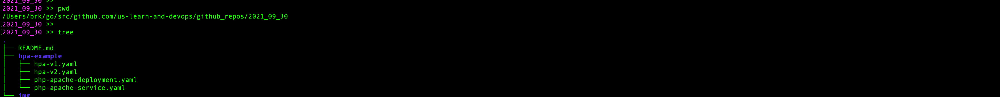

* Install the k8s Metrics Server

      kubectl apply -f https://github.com/kubernetes-sigs/metrics-server/releases/latest/download/components.yaml
      kubectl get deployment metrics-server -n kube-system
      kubectl get pods -n kube-system -l k8s-app=metrics-server

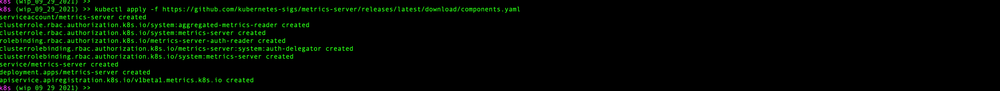
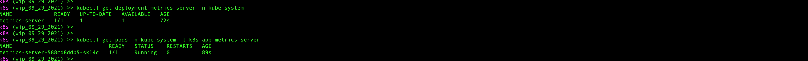

* Create a namespace

      kubectl create ns hpa-example

* Jump into the `hpa-example` folder and spin up the example Deployment and Service

      cd hpa-example/
      kubectl apply -f php-apache-deployment.yaml -n hpa-example; kubectl apply -f php-apache-service.yaml -n hpa-example
      kubectl get pods -n hpa-example
      kubectl get hpa -n hpa-example

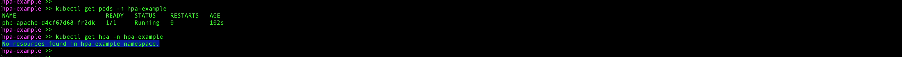

* Use kubectl to quickly create a simple `v1` HPA that will autoscale the Deployment based on CPU utilization

      kubectl autoscale deployment php-apache --cpu-percent=50 --min=1 --max=10 -n hpa-example
      kubectl get hpa -n hpa-example

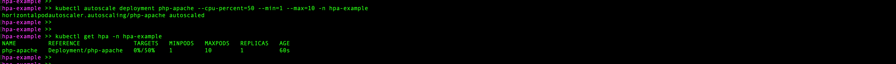

* Delete that kubectl-generated HPA and re-create it using a YAML file that uses the `v1` version of the HPA API.

      kubectl delete hpa php-apache -n hpa-example
      kubectl apply -f hpa-v1.yaml -n hpa-example

  wait a moment...

      kubectl describe hpa php-apache -n hpa-example

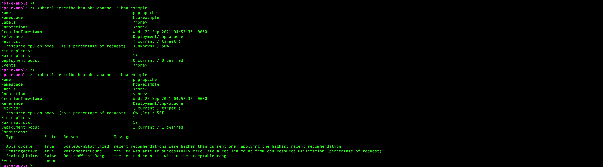

* In separate terminal, run...

      kubectl run --rm -it -n hpa-example load-generator --image=busybox --restart=Never -- /bin/sh -c "while sleep 0.01; do wget -q -O- http://php-apache; done"
  
  This will send many requests to the `php-apache` Deployment in the `hpa-example` namespace, spiking its CPU needs.
  This should trigger the HPA to scale up the Deployment's ReplicaSet.

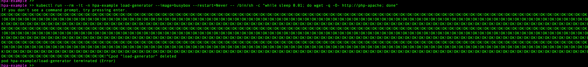

  Meanwhile, in original terminal, we see the Deployment scale up:

    kubectl get hpa php-apache -n hpa-example
    kubectl get deployment php-apache -n hpa-example

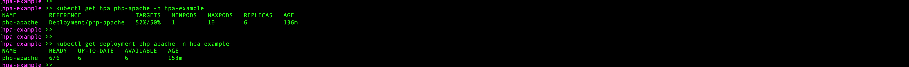

  Wait a few minutes, then hit `Ctrl+C` in the 2nd terminal to stop generating requests.
  Again back in original terminal, after a few minutes, we see the Deployment scale back down:

    kubectl describe hpa php-apache -n hpa-example
    kubectl get deployment php-apache -n hpa-example

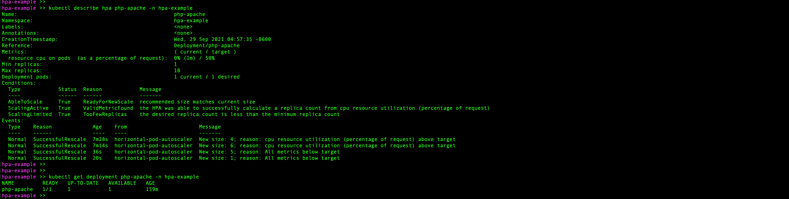

* Delete the `v1` HPA:

      kubectl delete hpa php-apache -n hpa-example

* Create a `v2beta2` HPA that can scale off metrics other than / in addition to CPU, such as memory.
  This should scale up based on memory alone, given the memory needs of the `php-apache` pods, even without trying to spike it via a barrage of requests:

      kubectl apply -f hpa-v2.yaml -n hpa-example
      kubectl describe hpa php-apache -n hpa-example
      kubectl get deployment php-apache -n hpa-example

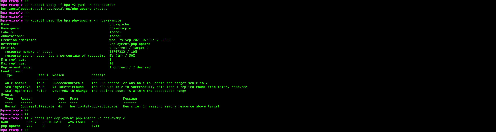

* OK. This demo is complete. Clean it up:

      kubectl delete ns hpa-example

### 4. Add an HPA to our `todoapi`

* Open the `todoapi` root directory in your terminal. Ensure you've got env vars TODOAPI_SECRETS_PATH, DOCKER_SERVER, DOCKER_USERNAME, DOCKER_PSWD, and DOCKER_EMAIL set in your terminal session. Also ensure you've customized the `ingress.yaml` with the subdomain for todoapi you set up, if you did so. Then run the deployment to at least one environment (e.g. `dev`):

      cd build/k8s
      ./deploy.sh dev

* (Note that if you want to test the API in a browser or via curl, you'll need to update your CNAME record for )

* The Deployment is setup with a replica count of just 1, so we should have deployed a single pod. Let's grab the name of that pod:

      kubectl get pods -n dev

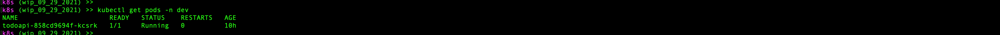

* Because we added a Metrics Server to our k8s cluster, we can query the basic Metrics API and get some CPU and memory usage stats on this pod:

      kubectl get --raw /apis/metrics.k8s.io/v1beta1/namespaces/dev/pods/todoapi-858cd9694f-kcsrk | jq

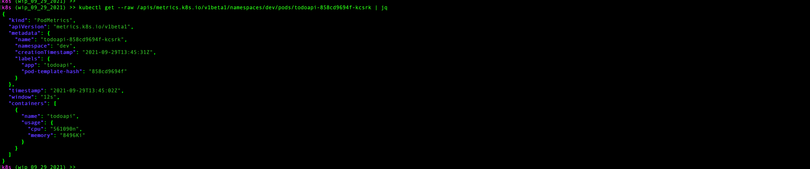

      kubectl top pod todoapi-858cd9694f-kcsrk -n dev

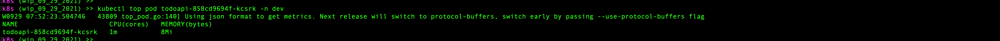

  Note that CPU and memory units can vary depending on how you query the API, and depending on the values reported.
  See [Understanding Kubernetes Resource (CPU and Memory) Units](https://medium.com/swlh/understanding-kubernetes-resource-cpu-and-memory-units-30284b3cc866)) for a refresher on how to interpret and relate these units.

  Looks like todoapi is idling at about 8Mi (Mebibyte = 2^20 bytes) memory.

* Let's try applying an HPA to scale up to 2 replicas based on memory. Create a file called `hpa.yaml` in the `build/k8s` directory and add the following contents:

      apiVersion: autoscaling/v2beta2
      kind: HorizontalPodAutoscaler
      metadata:
        name: todoapi
        labels:
          app: todoapi
      spec:
        scaleTargetRef:
          apiVersion: apps/v1
          kind: Deployment
          name: todoapi
        minReplicas: 1
        maxReplicas: 5
        metrics:
          - type: Resource
            resource:
              name: memory 
              target:
                type: Utilization 
                averageValue: 5Mi

  We're using the `v2beta2` autoscaling API so we can scale off memory. If we set the target value to 5Mi (< 8Mi), we should trigger a scalu-up.

* Apply the HPA and see what happens:

      kubectl apply -f hpa.yaml -n dev
      kubectl describe hpa todoapi -n dev
      kubectl get deployment todoapi -n dev

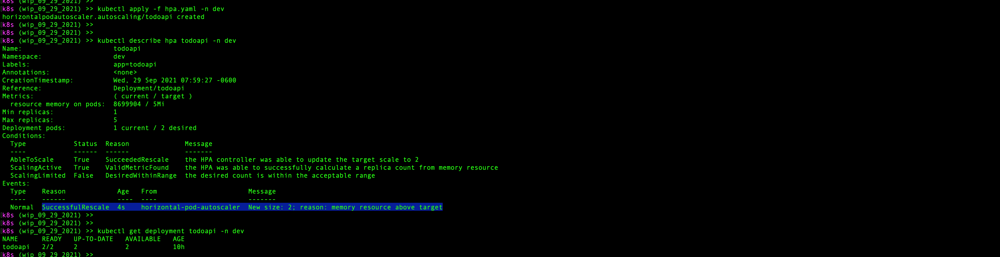

* That scale-up happened very quickly. Let's see if we can understand why, and experiment with using additional configs the `v2beta2` autoscaling API offers to try slowing it down.
  First, though, we'll change the average utilization target to 20Mi to scale back down to 1 pod...

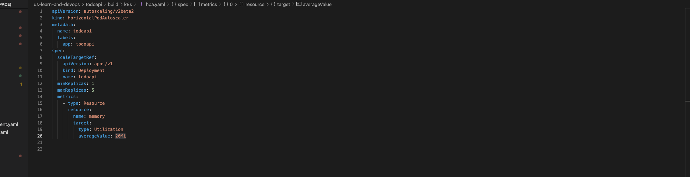

      kubectl apply -f hpa.yaml -n dev

  After a few minutes (it should take a little more than a minute; we're about to see why):

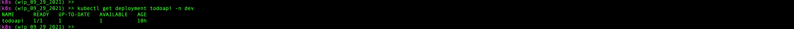

* Here's the default scale-down/scale-up behavior: <https://kubernetes.io/docs/tasks/run-application/horizontal-pod-autoscale/#default-behavior>
  Let's adjust the scale-up behavior:

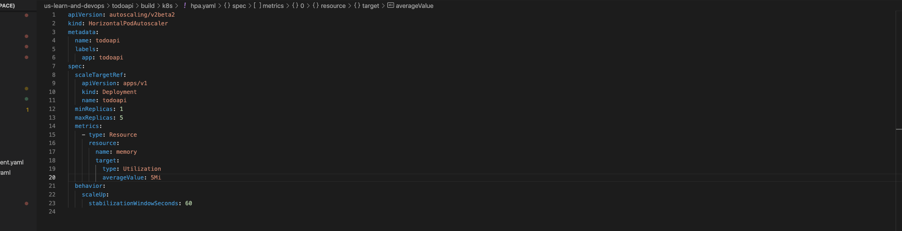

      kubectl apply -f hpa.yaml -n dev

  After a minute (it takes a minute *this time*):

      kubectl describe hpa todoapi -n dev

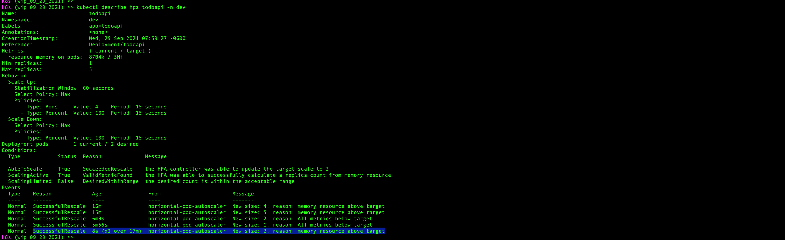

### 5. Clean up

Don't forget to spin down all your AWS resources:

    cd ..
    ./cluster-destroy
